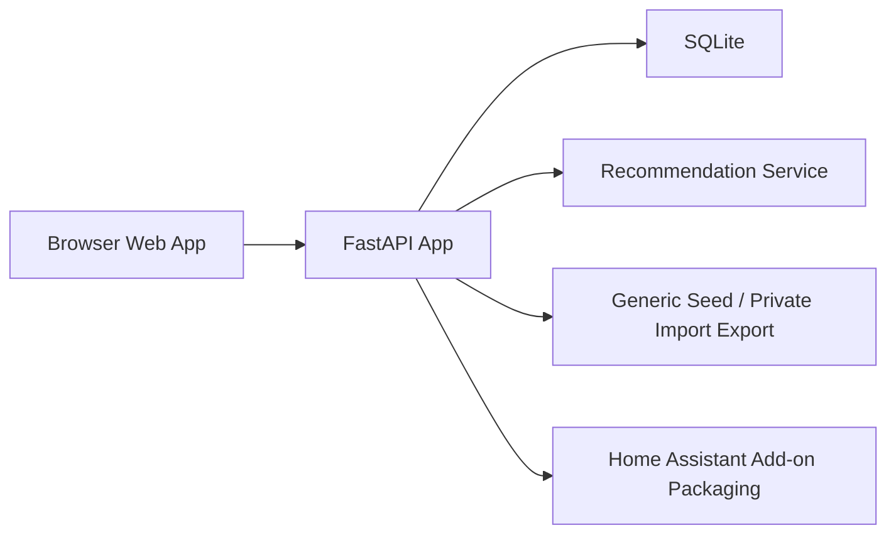

# System Architecture

## Overview

Family Menu has four initial layers:

1. Static Angular browser UI for planning, catalog edits, grocery/prep, history, and settings.
2. FastAPI application for meal catalog, weekly plans, history, and recommendation APIs.
3. SQLite database for durable local storage.
4. Import/export and seed data files for backup, migration, and generic starter meals.
5. Home Assistant add-on packaging for local-network and ingress deployment.

## Frontend Architecture

- The browser UI is an Angular standalone-component application.
- Angular Material is the primary component library for controls, form fields, navigation, cards, chips, icons, snack bars, dialogs, and progress states.
- Material theming should be configured inside the Angular frontend and built into the static assets served by FastAPI.
- The default Material theme should be dark mode, with dark base surfaces and readable contrast for all primary workflows.
- App-specific CSS remains responsible for dense planner layouts, responsive grids, and workflow-specific row composition.
- The frontend should not introduce cloud dependencies, analytics, authentication, or extra state-management libraries as part of the Material refactor.

## Data Flow

- The app starts with either generic sample data or a private local seed file.
- The user configures household members, serving needs, dietary profiles, and mixed-diet recommendation mode.
- The user edits meals, variation dimensions, variation options, proteins, likability, tags, prep notes, and ingredients.
- The user creates or opens a weekly plan for a Sunday-starting week.
- The recommendation service scores eligible meals and eligible variation options using likability, eating history, recency, prep usefulness, leftover variety, and locked plan state.
- The user manually adjusts the plan by replacing top-level meals, reordering meals, locking meals, or swapping individual variation options within a meal.
- The grocery and prep view aggregates the selected week into Sunday shopping and prep work.
- When dinners happen, the user marks planned meals and their selected variation options eaten, skipped, or moved.
- Meal events update history and influence future suggestions.

## Local-First Strategy

- The SQLite database is the source of truth.
- The app should work on a local network without cloud dependencies.
- Export/import should be available so meal data is not trapped in the app.
- Export JSON is a portable app-data backup, not a Home Assistant add-on options backup.
- Import JSON should restore app-owned data from a prior export with transactional all-or-nothing behavior.
- The first import implementation should support full overwrite restore only; merge import is deferred because meal, variation, plan, history, and checklist conflict handling needs explicit product decisions.
- The default local database path is repo-local for development, but database files must be ignored by git.
- Private seed files and exports must be ignored by git unless intentionally sanitized and renamed as examples.
- A Home Assistant add-on wraps the same app with Home Assistant-compatible packaging and ingress.
- In add-on deployments, persistent data lives under `/data`, with `/data/family-menu.sqlite` as the default SQLite path.
- In add-on deployments, runtime options can be read from `/data/options.json`, while environment variables remain the highest-precedence override for development and tests.
- The Angular frontend is built into static assets during the add-on image build and served by FastAPI from the package static directory.

## Privacy Strategy

- Household meal preferences, eating history, and notes stay local by default.
- Household composition, dietary profile assignments, real meal catalogs, likability scores, and generated plans are private local data.
- Tracked repository files should use generic household terms and generic sample meals only.
- The app should support a private seed/catalog path for one installation without requiring those meals to be committed.
- No third-party analytics, account system, or external API calls are needed for the initial app.
- If remote access is later desired, it should be handled by the user's existing secure remote access pattern, such as Home Assistant remote access, VPN, or a reverse proxy configured outside the app.

## Configuration Model

Configurable values:

- Household name.
- Household members and per-member dinner/leftover serving counts.
- Dietary profiles and custom restrictions.
- Mixed-diet recommendation mode: separate variations or common compatible only.
- Default weekly dinner count, initially 5.
- Grocery shopping day, initially Sunday.
- Week start day, initially Sunday.
- Leftover lunch servings, initially 2.
- Max same meal per week, initially 1.
- Minimum soft repeat gap in days.
- Recommendation weights.
- Default servings and prep window.
- Whether variation-option recency should be weighted separately from top-level meal recency.

## Delivery Order

1. Specs and starter catalog.
2. Backend data model and seed import.
3. Recommendation service and tests.
4. Weekly Plan screen.
5. Meal Catalog screen.
6. Grocery and Prep screen.
7. History and Settings screens.
8. Home Assistant add-on packaging and publish workflow.
